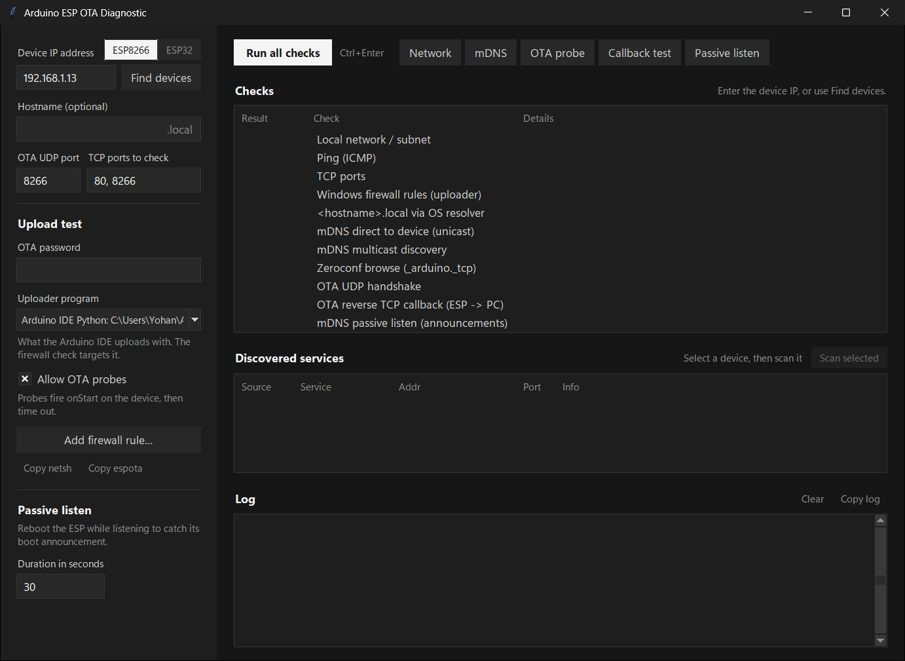

# Arduino ESP OTA Diagnostic

A desktop tool that finds out why an ESP8266 or ESP32 doesn't show up as a network port in the Arduino IDE, or why an OTA upload fails with `No response from device`.

It walks the whole path an OTA upload takes, from basic reachability through mDNS discovery to the device connecting back to your PC, and tells you which step breaks and what to do about it.



## Requirements

- Python 3 with tkinter (included in the standard Windows and macOS installers)
- Optional: `pip install zeroconf` to enable the Zeroconf browse check

Everything else uses the standard library. The firewall checks work on Windows only; the rest runs on Windows, macOS and Linux.

## Run

```sh
python main.py
```

1. Pick the board family (**ESP8266** or **ESP32**) and enter the device's IP address. Add its hostname (without `.local`) if you want the name-resolution checks.
2. For the upload test, enter the OTA password and leave **Uploader program** on what the Arduino IDE uses, so the firewall verdict matches a real upload.
3. Press **Run all checks** (or Enter, Ctrl+Enter, F5).

### Don't know the IP?

Press **Find devices** above the Discovered services table. It looks two ways, without touching the OTA port:

- **mDNS**: asks the network for `_arduino._tcp`, the same way the Arduino IDE does, and shows each device's IP and hostname.
- **ARP scan**: if mDNS is blocked, it sends an empty packet to every address on your `/24` subnet, then lists those whose network adapter was made by Espressif (the ESP chip maker).

With one device found, its IP is filled in for you. With several, double-click one. If nothing turns up, the device is probably not on Wi-Fi or is on another subnet: read its IP from the serial monitor or your router's client list.

Results appear in the checks table, and a diagnosis with next steps is written to the log at the end of the run.

## What it checks

| Check | What it tells you |
| --- | --- |
| Local network / subnet | Which PC interface reaches the device, and whether both are on the same subnet |
| Ping | Whether the device is alive |
| TCP ports | Whether the web server or other ports are open |
| Windows firewall rules | Whether inbound rules allow the uploader program (Windows only) |
| `<hostname>.local` via OS resolver | Whether this PC can resolve `.local` names (Bonjour / avahi) |
| mDNS direct | What the device advertises, asked directly (unicast to port 5353) |
| mDNS multicast | Whether multicast discovery replies reach this PC |
| Zeroconf browse | Browses `_arduino._tcp` the way the IDE does (needs `zeroconf`) |
| OTA UDP handshake | Sends an espota-style invitation to the OTA port |
| OTA reverse callback | Full handshake including the password, and checks that the ESP can open the TCP connection back to the PC |
| mDNS passive listen | Joins the mDNS group and watches whether the ESP's announcements arrive |

Each button in the top bar runs a group of these on its own. **Passive listen** runs for the duration set in the sidebar; reboot the ESP while it listens to catch the announcement it sends at boot.

> The OTA probes trigger `onStart` on the device, which then times out. Untick **Allow OTA probes** if that is a problem for your sketch.

## Supported boards

| | ESP8266 | ESP32 |
| --- | --- | --- |
| Default OTA port | 8266 | 3232 |
| Uploader the IDE runs on Windows | the core's bundled `python3.exe` with `espota.py` | `espota.exe` |
| OTA password check | MD5 | MD5 before core 3.3.1, PBKDF2-SHA256 from 3.3.1 |

Switching the board swaps the OTA port (unless you changed it) and lists that core's uploaders, found in your `Arduino15` folder. The callback test needs a Python to run in: with `espota.exe` selected it uses this tool's Python, so check the firewall result for `espota.exe` separately.

## Fixing a firewall block

If the callback test fails and the firewall check flags the uploader program:

- **Add firewall rule…** creates an inbound TCP allow rule for it (Windows asks for administrator rights), then re-checks.
- **Copy netsh** copies the equivalent command to run yourself in an administrator prompt.

Run the callback test again afterwards. **Copy espota** copies a ready-made upload command for uploading by IP.

## Common outcomes

- **Device not reachable**: wrong IP, device off Wi-Fi, or the router isolates clients.
- **Reachable, but no OTA reply**: the running firmware isn't serving OTA. Check that `ArduinoOTA.begin()` runs after Wi-Fi connects and `ArduinoOTA.handle()` runs in `loop()`, then flash once over USB.
- **OTA replies, callback fails**: the ESP can't connect back to the PC. This is what makes espota report `No response from device`. Usually a firewall, VPN, or virtual network adapter.
- **Device advertises correctly, but multicast doesn't arrive**: allow UDP 5353 inbound, disable VPNs or extra adapters, and check router IGMP snooping or AP isolation.
